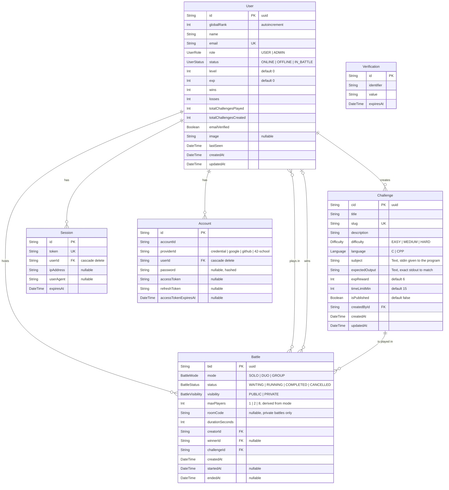

*This project has been created as part of the 42 curriculum by abdael-m, abifkirn, bnafiai, zmounji.*

# Code Battle

Real-time competitive programming arena. Players write **C** or **C++** in the browser, submit against a sandboxed judge, and the first one whose output matches the expected output wins the battle.

---

## Table of Contents

- [Description](#description)
- [Team Information](#team-information)
- [Project Management](#project-management)
- [Technical Stack](#technical-stack)
- [Database Schema](#database-schema)
- [Features List](#features-list)
- [Modules](#modules)
- [Individual Contributions](#individual-contributions)
- [Known Limitations](#known-limitations)
- [Resources](#resources)
- [Credits and License](#credits-and-license)

---

## Description

**Code Battle** is a web application where players compete on programming challenges in real time.

The goal is to turn solving an exercise into a live, competitive match. A player writes a challenge (statement, standard input, expected output, difficulty, language, time limit), publishes it, and any other player can open a **battle** on it. Everyone in the battle receives the same problem and the same clock at the same instant, writes code in an in-browser editor, and submits it to a sandboxed judge. The server compiles and runs each submission in isolation, compares its standard output against the expected output, and the **first correct submission ends the battle for everyone**. If nobody solves it before the clock runs out, the battle closes with no winner.

Winning grants experience points, which drive a level system and a global leaderboard, so progression is persistent across matches.

### Key features

- **Live multiplayer battles** — Solo, Duo, and Group (up to 8 players), public or private with a room code.
- **In-browser code editor** with C/C++ syntax highlighting, written from scratch (no editor library).
- **Sandboxed judge** — untrusted C/C++ is compiled and executed in isolation, with verdicts (accepted, wrong answer, compile error, runtime error, time limit exceeded).
- **Authoritative real-time server** — battle lifecycle, clock, and first-solver resolution are decided server-side and broadcast over WebSockets; players see each other's live activity ("running", "wrong answer", "won").
- **Player-created challenges** with a full create/edit/delete flow and admin publication control.
- **Progression and ranking** — XP, levels, wins, losses, win rate, and a searchable/filterable/paginated global leaderboard.
- **Multiple authentication methods** — email + password, Google, GitHub, and 42 OAuth.
- **Presence** — online / offline / in-battle status, reflected live to every connected player.
- **Role-based access** — user and admin roles, with admin-only actions and views.
- **Full observability stack** — Prometheus + Grafana + Alertmanager for metrics and alerting, ELK + Filebeat for centralized logs.
- **Single-command deployment** — `make` brings the whole platform up behind an HTTPS reverse proxy.

---

## Team Information

The team has 4 members, so some members hold more than one role, as allowed by the subject.

| Member | 42 login | Role(s) | Responsibilities |
| --- | --- | --- | --- |
| Abdallah El Madi | `abdael-m` | **Tech Lead / Architect** + **Project Manager** + Frontend Developer | Defined the technical architecture and the stack. Owns the entire frontend (Next.js application, design system, real-time client, SSR data layer). Reviewed critical code changes across the repository, performed the final integration of the four workstreams into `main`, and enforced code quality and conventions. As PM: organized the work breakdown, tracked progress and deadlines, unblocked members, and managed integration risk. |
| Badr Eddine Nafiai | `bnafiai` | **Developer** (Backend) | NestJS backend: authentication integration (better-auth, OAuth providers, sign-in/sign-out hooks), user module (profile, presence, roles, XP and level computation), challenge module (CRUD, ownership and permission rules, DTO validation), Prisma schema and migrations. |
| Aimad Bifkirn | `abifkirn` | **Developer** (Backend) | NestJS backend: battle module (full battle lifecycle, transactional state changes, Redis caching), Socket.IO gateway (all real-time events, room management, per-battle timers), judge pipeline (sandbox integration, verdict handling, output comparison, submission rate limiting), interceptors and rate-limit middleware. |
| Zakaria Mounji | `zmounji` | **Product Owner** + **Developer** (DevOps) | As PO: defined the product vision (competitive coding arena), prioritized the feature backlog, validated completed work, and represented the product during reviews. As DevOps: containerization of every service, PostgreSQL and Redis images with provisioning scripts, nginx TLS reverse proxy, the Prometheus/Grafana/Alertmanager monitoring stack, and the ELK logging stack. |

### Git identity map

Commits were authored from several machines and Git identities. This maps them to team members so the history can be verified:

| 42 login | Git author name(s) |
| --- | --- |
| `abdael-m` | `Abdallah EL"MADI` |
| `abifkirn` | `AimadBifkirn` |
| `bnafiai` | `Batrii` |
| `zmounji` | `zakariamounji`, `zakariamounji2` |

---

## Project Management

### How the work was organized

We split the project along the deployment boundary — frontend, backend, and infrastructure — because those three parts have narrow, well-defined contracts between them (an HTTP/WebSocket API and a set of containers). That let three workstreams progress in parallel without blocking each other.

- **Work breakdown.** The Product Owner turned the product vision into a prioritized backlog of features. The Tech Lead broke each feature into frontend / backend / infrastructure tasks and assigned them.
- **Branch-per-member workflow.** Each member worked on their own long-lived branch (`front-end-by-abdael-m`, `bnafiai`, `abifkirn`, `backend`, `zmounji`) and integration happened into `main` through merges reviewed by the Tech Lead. The branches are still on the remote and show each member's individual history.
- **Contract-first integration.** The API shape (routes, payloads, socket event names) was agreed before frontend and backend were written, so both sides could be built against the same contract before they were ever connected.
- **Code reviews.** The Tech Lead reviewed changes before they reached `main`; backend developers reviewed each other's modules (the `gateway reviewd` and `review all monitoring services` commits are examples of these review passes).
- **Regular sync.** Short syncs at the start of each working session to report progress, raise blockers, and re-prioritize.

### Tools

| Purpose | Tool |
| --- | --- |
| Source control and code review | Git + GitHub (branch per member, merges into `main`) |
| Task tracking and backlog | GitHub branches per workstream + a shared task document |
| Communication | Discord (daily coordination) and in-person sessions at 1337 |
| Local orchestration | `make` targets over Docker Compose |
| Runtime observability during development | Grafana dashboards and Kibana log search |

---

## Instructions

### Prerequisites

| Requirement | Version / notes |
| --- | --- |
| Docker Engine | 24 or newer, with the Compose v2 plugin (`docker compose`) |
| GNU Make | any recent version |
| Free RAM | ~2 GB for the application, ~4 GB more if you also start the monitoring stack (Elasticsearch and Logstash reserve JVM heap) |
| Free ports | `8443` for the application. Monitoring additionally uses `9090`, `3005`, `5601` |
| Google Chrome | latest stable (the reference browser for this project) |
| Firefox | latest stable |

Node.js is **not** required on the host — everything builds inside containers.

### 1. Clone the repository

```bash
git clone <repository-url> transcendence
cd transcendence
```

### 2. Create the environment file

All secrets live in a single `.env` file at the repository root. It is ignored by Git; `.env.example` is the committed template.

```bash
cp .env.example .env
```

Then open `.env` and replace every `xxx` placeholder. The variables are grouped by service:

| Group | Variables | Notes |
| --- | --- | --- |
| Backend | `NODE_ENV`, `DATABASE_URL`, `BETTER_AUTH_SECRET`, `BETTER_AUTH_URL` | `DATABASE_URL` must match the database credentials below. `BETTER_AUTH_SECRET` should be a long random string. `BETTER_AUTH_URL` is `https://localhost:8443`. |
| OAuth providers | `GOOGLE_CLIENT_ID` / `_SECRET`, `GITHUB_CLIENT_ID` / `_SECRET`, `SCHOOL42_CLIENT_ID` / `_SECRET` | Register an OAuth application with each provider and set the callback URL to `https://localhost:8443/api/auth/callback/<provider>` (`.../oauth2/callback/42-school` for 42). Providers you leave empty simply will not work; email + password authentication still does. |
| Judge | `X_API_KEY` | API key for the Rustbox sandbox service. **Code submission does not work without it.** |
| Database | `POSTGRES_USER`, `POSTGRES_PASSWORD`, `DB_NAME`, `DB_USER`, `DB_PASSWORD`, `EXPORTER_USER`, `EXPORTER_PASSWORD` | Consumed by `db/setup.sh` on first boot, which creates the application role, the database, and the metrics exporter role. |
| Frontend | `NEXT_PUBLIC_BACKEND_URL`, `NEXT_PUBLIC_FRONTEND_URL`, `INTERNAL_BACKEND_URL` | The two public URLs are `https://localhost:8443` (they are baked in at build time). `INTERNAL_BACKEND_URL` is `http://backend:3000` and is used for server-side rendering inside the Docker network. |
| Redis | `REDIS_HOST`, `REDIS_PORT`, `REDIS_PASSWORD`, `REDIS_URL`, `REDIS_APPENDONLY`, `REDIS_MAXMEMORY`, `REDIS_MAXMEMORY_POLICY`, `REDIS_LOGLEVEL` | `REDIS_URL` must embed the same password and port. |
| Monitoring | `GF_SECURITY_ADMIN_USER` / `_PASSWORD`, `GF_AUTH_ANONYMOUS_ENABLED`, `POSTGRES_EXPORTER_PASSWORD`, `POSTGRES_EXPORTER_DSN` | Grafana admin credentials. Keep anonymous access disabled. |
| Logging | `ELASTIC_PASSWORD`, `KIBANA_SYSTEM_PASSWORD`, `KIBANA_SECURITY_ENCRYPTION_KEY`, `KIBANA_SAVED_OBJECTS_ENCRYPTION_KEY`, `KIBANA_REPORTING_ENCRYPTION_KEY` | The three Kibana keys must each be at least 32 characters, otherwise saved objects and alerting are dropped on every restart. |
| Alerting | `ALERT_SMTP_HOST`, `ALERT_EMAIL_FROM`, `ALERT_EMAIL_TO`, `ALERT_SMTP_PASSWORD` | Optional. Without them alerts still fire and are visible in the Alertmanager UI, they are just not emailed. |

### 3. Start the application

```bash
make
```

This checks that `.env` exists, creates the external Docker network, then builds and starts the database, Redis, backend, frontend, and the nginx reverse proxy. Database migrations are applied automatically by the backend container on start (`prisma migrate deploy`).

Open **https://localhost:8443**

> The TLS certificate is self-signed and generated during the nginx image build, so Chrome shows a warning on first visit. Choose *Advanced → Proceed*. This is expected for a local deployment.

### 4. Start the monitoring and logging stack (optional)

```bash
make monitoring
```

| Service | URL | Credentials |
| --- | --- | --- |
| Grafana | http://localhost:3005 | `GF_SECURITY_ADMIN_USER` / `GF_SECURITY_ADMIN_PASSWORD` |
| Kibana | http://localhost:5601 | `elastic` / `ELASTIC_PASSWORD` |
| Prometheus | — | — |
| Alertmanager | — | — |
| Elasticsearch | — | — |

The Grafana datasource and the *Transcendence Overview* dashboard are provisioned automatically.

### 5. Other commands

```bash
make status       # show the state of every container, application and monitoring
make clean        # stop and remove all containers and the shared network
make help         # list available targets
```

### Trying it out

1. Open the site in two different browser profiles (or two machines on the same network) and sign in as two different players.
2. As player A, create a challenge: a title, a slug, a statement, the standard input your program will receive, and the exact expected output.
3. Publish it (an admin account is required to publish; the four team 42 accounts are promoted to admin automatically on 42 login, and any admin can promote another player from the leaderboard).
4. Open a **Duo** or **Group** battle on that challenge. Player B joins it from the *Open battles* list.
5. The host starts the battle. Both players land in the arena with the same clock, write code, and submit. The first correct submission ends the battle and takes the XP.

---

## Technical Stack

### Frontend

| Technology | Why |
| --- | --- |
| **Next.js 16** (App Router) + **React 19** | A full framework rather than a bare SPA: file-based routing, React Server Components, and server-side rendering come built in. Server Components let every page fetch its data on the server with the session cookie already attached, so the first paint is already populated and no protected data ever transits through client-side state. |
| **TypeScript** | The API payloads are shared, non-trivial shapes (battles, challenges, submissions). Typing them once in `interfaces.ts` catches contract drift between frontend and backend at compile time. |
| **Tailwind CSS v4** | Chosen over a component library so the design system could be ours: a custom token layer in `oklch` colour space, custom utilities (`panel-sheen`, `card-lift`, `btn-brand`, `text-gradient`), and no imported visual identity to fight against. |
| **Base UI / shadcn primitives** | Used only for the accessibility-critical primitives (dialog, select) — focus trapping and keyboard semantics are easy to get subtly wrong by hand. Everything visual on top of them is ours. |
| **Socket.IO client** | Matches the backend gateway, and gives automatic reconnection with an event API instead of raw WebSocket frame handling. |
| **Hugeicons** | A single consistent icon set for the whole interface. |

### Backend

| Technology | Why |
| --- | --- |
| **NestJS 11** | Its module system maps cleanly onto our domain (auth, user, challenge, battle, gateway) and its dependency injection let the four modules be developed and tested independently. Guards, interceptors, pipes, and WebSocket gateways are first-class, so cross-cutting concerns (authentication, response shaping, validation, rate limiting) are declared once instead of repeated per handler. |
| **Socket.IO** (`@nestjs/websockets`) | Real-time is the core of the product. Rooms give us per-battle broadcast for free, and the acknowledgement callbacks let a client action (submit, join, start) return a direct result while still fanning out an event to every other player. |
| **Prisma 7** | Type-safe queries generated from a single schema file, first-class migrations, and interactive transactions — which we rely on for the race-sensitive parts of the battle lifecycle. |
| **better-auth** | Sessions, password hashing, and OAuth in one library. Its generic OAuth plugin let us add the 42 provider (which is not a built-in) with a custom `getUserInfo` against the 42 intra API, and its `additionalFields` support puts our `role` and `status` columns directly into the session object, so authorization checks need no extra query. |
| **class-validator** + global `ValidationPipe` | Every request body is validated against a DTO on the server, independently of the frontend. |
| **express-rate-limit** and **rate-limiter-flexible** | HTTP route limiting and per-user submission limiting respectively. |
| **Rustbox** | The sandbox that actually compiles and runs untrusted player code, out-of-process and isolated from our containers. |

### Database

| Technology | Why |
| --- | --- |
| **PostgreSQL 17** | The data is strongly relational — users, challenges, battles, and a many-to-many between players and battles — and correctness under concurrency matters more than anything else here: two players must never both be recorded as the winner, and a player must never be in two battles at once. We rely on real transactions with `updateMany`-based conditional locking to enforce that, which a document store would not give us. Its enum types also mirror the domain states (`BattleStatus`, `UserStatus`, `Difficulty`, `Language`) at the schema level. |
| **Redis 7** | Read cache for battle records, which are read on every socket event, plus a persistence configuration (AOF + RDB) and an LRU eviction policy. |

### Infrastructure

| Technology | Why |
| --- | --- |
| **Docker + Docker Compose** | Single-command deployment of nine application and monitoring services, reproducible on any machine. |
| **nginx** | TLS termination and the single entry point: it is the only container that publishes a port. It routes `/socket.io/` and the API prefixes to the backend and everything else to Next.js, so the browser only ever talks HTTPS to one origin. |
| **Prometheus, Grafana, Alertmanager, node-exporter, cAdvisor, postgres-exporter** | Metrics collection, dashboards, and alert routing for the host, the containers, and the database. |
| **Elasticsearch, Logstash, Kibana, Filebeat** | Centralized log collection from every container, with JSON log parsing and searchable daily indices. |

---

## Database Schema



### Tables and relationships

| Table | Purpose | Relationships |
| --- | --- | --- |
| **user** | A player. Holds identity, role, presence, and all progression counters (level, exp, wins, losses, challenges played/created). | 1→N `Challenge` (author), 1→N `Battle` (host), N↔N `Battle` (participant, via the implicit `_BattlePlayers` join table), 1→N `Battle` (winner), 1→N `session`, 1→N `account`. |
| **Challenge** | A problem: statement, the standard input handed to the program, the exact expected standard output, difficulty, language, XP reward, time limit, and publication state. | N→1 `user` (author), 1→N `Battle`. |
| **Battle** | A match on one challenge: mode, visibility, room code, player capacity, duration, and the full lifecycle timestamps. | N→1 `Challenge`, N→1 `user` (host), N→1 `user` (winner, nullable), N↔N `user` (players). |
| **session** | An authenticated session, with its token, IP, and user agent. Cascade-deleted with the user. | N→1 `user`. |
| **account** | One authentication method per row — a hashed password for credentials, or the provider tokens for Google / GitHub / 42. A user can therefore hold several login methods. | N→1 `user`. |
| **verification** | Short-lived verification tokens issued by the auth layer. | Standalone. |

**Design notes.**

- `maxPlayers` is derived from `mode` on the server (`SOLO` = 1, `DUO` = 2, `GROUP` = 8) so a client cannot inflate a battle's capacity.
- `winnerId` is nullable by design: a battle that runs out of time completes with no winner.
- `user.status` doubles as a lock. Creating a battle uses a conditional `updateMany` on `status != IN_BATTLE`, so the same player cannot end up in two battles even if two requests race.
- Domain states are PostgreSQL enums rather than free-form strings, so an invalid state cannot be written.

---

## Features List

| Feature | Description | Built by |
| --- | --- | --- |
| **Email + password authentication** | Sign up and sign in with hashed, salted credentials. Validated on the client (format, length) and on the server. | `bnafiai` (backend), `abdael-m` (UI, validation, error mapping) |
| **OAuth 2.0 sign-in** | Google, GitHub, and 42. The 42 provider is a custom generic-OAuth configuration that reads the intra API for profile, email, and avatar. | `bnafiai` |
| **Session handling** | Cookie-based sessions, read server-side during SSR and forwarded to the backend; sign-out flips the player to `OFFLINE` through a pre-hook before the session is destroyed. | `abifkirn` (hooks), `abdael-m` (SSR session layer) |
| **Profile page** | Avatar (with generated initials fallback), name, email, role and status badges, global rank, level with an XP progress bar, and six statistic tiles (battles, wins, losses, win rate, played, created). | `abdael-m` (UI), `abifkirn` (data + XP model) |
| **Presence system** | Online / offline / in-battle. The browser reports visibility changes, and uses `sendBeacon` on page hide so a closing tab is still recorded as offline. `IN_BATTLE` can only be set by the battle engine, never by a client. | `abdael-m` (client), `abifkirn` (endpoint + guard) |
| **Challenge creation** | Full form: title, slug, statement, standard input, expected output, difficulty, language, XP reward, time limit. Validated client-side and again server-side by DTO, with a unique-slug conflict check inside a transaction. | `bnafiai` (backend), `abdael-m` (form) |
| **Challenge management** | Edit and delete your own challenges. Deletion is refused for challenges already used in a battle, and published challenges can only be removed by an admin. | `bnafiai` (rules), `abdael-m` (UI) |
| **Challenge publication** | Unpublished challenges are visible only to their author and to admins; publishing is an admin action. | `bnafiai`, `abdael-m` |
| **Battle creation** | Open a battle on any published challenge: Solo, Duo, or Group; public, or private with a generated room code; configurable duration. A conditional transaction guarantees one battle per player. | `abifkirn` (backend), `abdael-m` (UI) |
| **Battle lobby** | Live list of open battles with waiting/running counts, join by click, join private battles by room code, host controls (start, cancel), and leave. Updates arrive over WebSocket, with a polling resync as a fallback. | `abifkirn` (events), `abdael-m` (UI + client state) |
| **Battle lifecycle** | Waiting → running → completed / cancelled, entirely server-side. Joining, leaving, starting, and cancelling all reconcile player presence; cancelling releases every participant; leaving a running battle counts as a loss. | `abifkirn` |
| **Server-side clock** | Each running battle arms a server timer for its duration. If it expires the battle closes with no winner and every client is told. The browser only renders a countdown derived from `startedAt`. | `abifkirn` (server), `abdael-m` (countdown) |
| **Code editor** | Custom in-browser editor: a transparent textarea layered over a syntax-highlighted `pre`, single-pass tokenizer for C/C++ comments, preprocessor directives, strings, keywords and numbers, synchronized scrolling, tab insertion, and a per-language starter template. No editor library. | `abdael-m` |
| **Sandboxed judging** | A submission is compiled and executed in an isolated sandbox with the challenge's standard input, and returns a verdict, stdout, stderr, exit code, and failure cause. Verdicts are normalized into readable outcomes. | `bnafiai` |
| **First-solver-wins resolution** | On an accepted run the server compares stdout against the expected output; a match disarms the battle timer, ends the battle, awards XP to the winner, records a loss for everyone else, and releases all presence locks — atomically enough that the clock cannot end a battle that was already won. | `abifkirn` |
| **Submission abuse protection** | Five submissions per player per minute, plus a single-in-flight guard so one player cannot queue parallel runs against the judge. | `abifkirn` |
| **Live battle activity** | Every player in a battle sees what the others are doing in real time — running, wrong answer, crashed, did not compile, too slow, won — without ever seeing their code. | `abifkirn` (broadcast), `abdael-m` (UI) |
| **Reconnection handling** | The client shows a live/reconnecting indicator, resynchronizes on reconnect, and re-reads state on a timer whenever the tab is visible, so a dropped connection never leaves a stale arena. | `abdael-m` |
| **XP and level progression** | A win grants the challenge's XP reward (6 by default); 100 XP is one level. Wins, losses, and challenges played are counted. Persisted in PostgreSQL. | `bnafiai` |
| **Global leaderboard** | Every player ranked by level, then experience, then wins. Search by name, filter by presence status, paginated ten per page, with podium highlighting and your own row pinned visually. | `abifkirn` (ranking query), `abdael-m` (board) |
| **Roles and admin actions** | `USER` / `ADMIN`. Admins see unpublished challenges, can delete any challenge, publish challenges, and promote another player to admin from the leaderboard. The role travels inside the session, and clients cannot set their own role or status. | `bnafiai` (backend), `abdael-m` (admin UI) |
| **Design system** | Custom `oklch` token palette (brand, three surface levels, three border levels, two muted text levels), custom utilities for panels, hover lift, gradient buttons, gradient text and pulse glow, a `Geist Mono` type scale, a single icon set, and ~20 reusable components. | `abdael-m` |
| **Privacy Policy and Terms of Service** | Full pages written for this project — what is collected, authentication providers, code submissions, retention, rights, conduct rules, and the judge's execution limits. Reachable from the authentication screen. | `abdael-m` |
| **Consistent API envelope** | A global interceptor wraps every REST response as `{ statusCode, message, data }`, and the socket client unwraps it, so the frontend has one response shape to handle. | `abifkirn` |
| **Server-side validation** | A global validation pipe validates every DTO: enums, UUIDs, string lengths, integer bounds, optional fields. | `bnafiai`, `abifkirn` |
| **Redis caching** | Battle records are cached for five minutes and explicitly invalidated on every mutation (join, leave, start, end, cancel). | `bnafiai` |
| **HTTPS everywhere** | nginx terminates TLS 1.2/1.3 with HTTP/2 on the single published port and proxies both HTTP and WebSocket upstreams. Nothing else is exposed. | `zmounji` |
| **Single-command deployment** | `make` validates the environment file, creates the shared network, and builds and starts every service. Migrations run automatically on backend start. | `zmounji`, `abdael-m` |
| **Database provisioning** | On first boot the PostgreSQL image creates the application role and database, transfers ownership, and creates a superuser role dedicated to the metrics exporter, all idempotently. | `zmounji` |
| **Redis provisioning** | The configuration is rendered from a template at container start, refusing to boot without a password, with AOF + RDB persistence, a memory ceiling, and LRU eviction. | `zmounji` |
| **Metrics and dashboards** | Prometheus scrapes host metrics (node-exporter), per-container metrics (cAdvisor), and database metrics (postgres-exporter). Grafana is provisioned with its datasource and a *Transcendence Overview* dashboard. Anonymous access is disabled. | `zmounji` |
| **Alerting** | Prometheus alert rules for database down, exporter unreachable, and node-exporter down, routed through Alertmanager with optional SMTP delivery and a null receiver fallback. | `zmounji` |
| **Centralized logging** | Filebeat ships every container's logs to Logstash, which decodes JSON payloads into a namespaced field and writes daily Elasticsearch indices; Kibana provides search. Elasticsearch security is enabled and the `kibana_system` password is provisioned by a one-shot init container. | `zmounji` |

---

## Modules

**Points required: 14. Points claimed: 23** (8 Major × 2 = 16, 7 Minor × 1 = 7).

We aimed well above the minimum on purpose, so that the project still clears 14 points even if some modules are not validated during evaluation.

### Claimed modules

| # | Category | Module | Type | Pts | How it is implemented | Owner(s) |
| --- | --- | --- | --- | --- | --- | --- |
| 1 | Web | Use a framework for both frontend and backend | Major | 2 | **Next.js 16** (App Router, React Server Components) on the frontend and **NestJS 11** on the backend. Both are used as frameworks, not as libraries: file-based routing, server rendering and server actions on one side; modules, dependency injection, guards, pipes, interceptors and a WebSocket gateway on the other. | `abdael-m`, `bnafiai`, `abifkirn` |
| 2 | Web | Real-time features using WebSockets | Major | 2 | A **Socket.IO** gateway guarded by the auth layer. Socket.IO rooms scope broadcasts to a single battle; a global `lobby:changed` event keeps every connected client's battle list fresh. Events cover players joining and leaving, battle start, submission started, verdict, player won, battle ended, cancelled, and live per-player activity. Disconnections are handled gracefully: the client exposes a live/reconnecting indicator, resynchronizes on reconnect, and falls back to visibility-gated polling. Broadcasting is efficient — code is never echoed to the room, only the fact that a player submitted and the resulting verdict. | `abifkirn`, `abdael-m`, `bnafiai` |
| 3 | Web | Use an ORM for the database | Minor | 1 | **Prisma 7** with the `@prisma/adapter-pg` driver adapter over a `pg` pool. One schema file generates the client; 11 committed migrations are applied automatically by the backend container on start. Interactive transactions are used for every race-sensitive write. | `bnafiai`, `abifkirn` |
| 4 | Web | Server-Side Rendering | Minor | 1 | Every page is a React Server Component. The home dashboard fetches profile, challenges, battles, and ranking on the server in parallel; the arena page loads and authorizes the battle server-side before rendering. A `serverFetch` helper forwards the session cookie to the backend over the internal Docker network, so protected data is rendered into the first response instead of being fetched from the browser. | `abdael-m` |
| 5 | Web | Custom-made design system with reusable components | Minor | 1 | A complete token layer in `oklch`: brand ramp (violet / pink / cyan), three surface levels, three border levels, two muted text levels, chart colours, and a radius scale. Six custom Tailwind utilities carry the visual identity (`panel-sheen`, `card-lift`, `btn-brand`, `fill-brand`, `text-gradient`, `dot-glow`, plus a keyframed glow animation), with themed selection colours and scrollbars. Typography is a `Geist Mono` scale; icons are a single set (Hugeicons). ~20 reusable components — `Button`, `Dialog`, `Input`, `Label`, `Select`, `Textarea`, `Avatar`, `Badge`, `Stat`, `Panel`, `StatusPill`, `Fact`, `Players`/`Player`, `Countdown`, `Rank`, `Cell`, `Editor`, `ChallengeCard`, `BattleCard`, `Grid` — well past the 10 required. | `abdael-m` |
| 6 | Web | Advanced search with filters, sorting and pagination | Minor | 1 | The leaderboard combines all four: live substring search by player name, a status filter (everyone / online / in battle / offline), multi-key server-side sorting (level, then experience, then wins), and pagination at ten rows per page with a range indicator and previous/next controls. Search and filter reset pagination so the view never lands on an empty page. | `abdael-m`, `abifkirn` |
| 7 | User Management | Remote authentication with OAuth 2.0 | Minor | 1 | Three providers through **better-auth**: Google and GitHub as built-in social providers, and **42** as a custom `genericOAuth` configuration against the intra authorize/token endpoints with a bespoke `getUserInfo` that maps display name, email, and avatar from `/v2/me`. Multiple providers can be linked to one user through the `account` table, and remote avatars are whitelisted per host in the image configuration. | `bnafiai`, `abifkirn` |
| 8 | Gaming and UX | Complete web-based game where users play against each other | Major | 2 | **Code Battle** itself. Clear rules: everyone in a battle receives the same problem, the same standard input, and the same clock; you must print exactly the expected output; the first player whose output matches wins and the battle ends immediately for everyone; if the clock expires first, nobody wins. Live matches are played in the arena — problem statement, editor, verdict panel, live opponent activity, and countdown. Win and loss conditions are resolved server-side and written to the database. | `abifkirn`, `abdael-m`, `bnafiai` |
| 9 | Gaming and UX | Remote players | Major | 2 | Two (or more) players on separate machines play the same battle in real time over a single authenticated WebSocket through nginx. Latency and disconnection are handled explicitly: a live/reconnecting indicator driven by the socket's own connection state, full state resynchronization on reconnect, visibility-gated polling as a safety net, an 8-second acknowledgement timeout on actions and 45 seconds for judging, and server-side authority so a client that misses events still converges on the correct state. Gameplay never trusts client timing — the clock is a server timer. | `abifkirn`, `abdael-m`, `bnafiai` |
| 10 | Gaming and UX | Multiplayer game (more than two players) | Major | 2 | `GROUP` mode supports up to 8 simultaneous players in one battle. Fairness is structural: all players get the identical challenge, identical standard input, and one shared clock started by the host for everyone at once. Synchronization is by Socket.IO room — a single broadcast reaches every participant with player list changes, activity updates, and the terminal result. Capacity is enforced server-side from the mode, and the winner is whoever the server accepts first, so the outcome does not depend on which client rendered fastest. | `abifkirn`, `abdael-m`, `bnafiai` |
| 11 | Gaming and UX | Gamification system | Minor | 1 | Four of the listed mechanics, all persisted in PostgreSQL: an **XP/level system** (a win grants the challenge's XP reward, 100 XP per level, with carry-over), **leaderboards** (global ranking by level → experience → wins), **rewards** (per-challenge configurable XP reward, 1–100), and **badges** (admin, presence, and podium badges). Visual feedback throughout: an animated level progress bar, live verdict pills, podium medals on the top three, and win/loss notices. Rules are explicit in the UI. | `bnafiai`, `abdael-m`, `abifkirn` |
| 12 | DevOps | Log management infrastructure with ELK | Major | 2 | **Filebeat** (container input, Docker metadata processor) ships every container's stdout to **Logstash**, which detects JSON payloads and decodes them into a namespaced `app` field so application keys cannot collide with ECS fields, tags the environment, and writes into daily **Elasticsearch** indices (`logs-YYYY.MM.dd`). **Kibana** provides search and dashboards. Access is secured: `xpack.security` is enabled, the `elastic` password comes from the environment, and a one-shot init container provisions the `kibana_system` password through the security API before Kibana starts. Kibana's three encryption keys are pinned so saved objects and alerting survive restarts. Health-gated `depends_on` ordering means the pipeline never starts against an unready Elasticsearch. | `zmounji` |
| 13 | DevOps | Monitoring system with Prometheus and Grafana | Major | 2 | **Prometheus** scrapes three exporters — **node-exporter** (host CPU, memory, disk), **cAdvisor** (per-container CPU and memory), and **postgres-exporter** (database health and connections, using a dedicated PostgreSQL role created at provisioning time). **Grafana** is provisioned as code: the datasource and a custom *Transcendence Overview* dashboard (services up, PostgreSQL up, host CPU %, host memory %, request rate, active connections) ship in the repository. Alerting is a full path: four Prometheus rules (database down, exporter unreachable, node-exporter down) routed to **Alertmanager**, which delivers by SMTP when credentials are present and falls back to a null receiver otherwise. Grafana access is secured with admin credentials and anonymous access disabled. | `zmounji` |
| 14 | Modules of choice | **Real-time competitive judge pipeline** | Major | 2 | See the justification below. | `abifkirn` |
| 15 | Modules of choice | **Redis caching and invalidation layer** | Minor | 1 | See the justification below. | `bnafiai`, `zmounji` |

### Why these modules

The module set was chosen after the product idea was settled, not before, and every module earns its place in *this* product rather than being bolted on:

- The **Web** modules are the foundation the product cannot exist without — two frameworks, an ORM, and server rendering — plus the two that our specific screens genuinely needed: a leaderboard is only usable with search, filtering, sorting and pagination, and a competitive arena needed a visual identity of its own rather than a stock component kit.
- The three **Gaming** modules are the product: it is a real game, played by remote players, and it scales past two of them. They were chosen together because each one is a real increment on the previous — a game, then a game across machines, then a game across up to eight machines — and each raised a distinct engineering problem (rules and resolution, latency and reconnection, fair synchronization).
- **Gamification** and **OAuth 2.0** are what make it a platform people return to: persistent progression, and one-click sign-in with the accounts our users (42 students) already have.
- The two **DevOps** modules were driven by the nature of the system: a real-time, multi-container application with an external judge fails in ways that are invisible from the outside. Metrics tell us a container is starving; logs tell us why a submission never came back. Both were needed during development itself, not added for points.

### Justification — Module of choice (Major): Real-time competitive judge pipeline

**Why we chose it.** Our project's defining feature has no matching module in the subject list. Running untrusted, user-submitted C/C++ and turning its result into the outcome of a live multiplayer match is the technical core of Code Battle, and it is neither a game module nor a web module — it is its own system.

**What technical challenges it addresses.**

- *Executing untrusted code safely.* Player code is arbitrary C/C++. It is never compiled or run inside our containers; it is dispatched to the **Rustbox** sandbox service (external, isolated, resource-limited), and the pipeline handles what comes back — including the sandbox's own failure modes: timeouts surfaced as a `TLE` verdict, sandbox rate limiting surfaced as a retryable error, and malformed responses coerced into a runtime error rather than crashing the gateway.
- *Deciding correctness authoritatively.* The standard input is taken from the challenge record, never from the client, so a player cannot feed their program an easier input. The expected output is compared server-side. An accepted compile-and-run is not a win — only a matching stdout is; anything else is reported back as a wrong answer.
- *Resolving a race between concurrent solvers.* Several players can submit within milliseconds of each other while a server timer is also racing to expire the battle. Winning disarms that timer before the battle is ended, and the terminal transition is guarded so a battle can only be completed once. The clock cannot end a battle that was already won, and a second solver cannot overwrite the first.
- *Protecting a shared, expensive resource.* The judge is the most expensive thing in the system and it is shared by every battle. Two layers protect it: a per-player token bucket (five submissions per minute) and a single-in-flight guard that refuses a submission while that player already has one running — enforced per user, not per socket, so opening a second tab does not double a player's throughput.
- *Fan-out without information leaks.* Every player in the battle learns that an opponent submitted and what verdict they got, in real time. Nobody ever receives anybody else's source code.

**How it adds value.** It is what makes the application a *competition* rather than a chat room with a text box. Without it there is no verdict, no winner, no progression, and no reason to play.

**Why it deserves Major status.** It spans the whole stack and combines several genuinely hard problems — untrusted execution, distributed race resolution, resource protection under concurrency, and selective real-time fan-out — into one pipeline that the rest of the product depends on. Honest scoping note: we did not build the sandbox itself, we integrated one; the module is the pipeline around it — input authority, verdict normalization, output adjudication, race-free resolution, rate limiting, and broadcast — all of which is our code and all of which is demonstrable.

### Justification — Module of choice (Minor): Redis caching and invalidation layer

**Why we chose it.** Battle records are the hottest read in the system. Every socket event handled — every submission, join, leave, start, end, and cancel — begins by reading the battle with its players and its challenge. Under a group battle with eight active players that is a burst of identical relational reads per second against PostgreSQL.

**What technical challenges it addresses.** Caching mutable game state is only safe if invalidation is exact: a stale battle record could let a player join a full battle, or submit to a battle that has already ended. Every write path in the battle service therefore invalidates the cached record explicitly, so the cache can never outlive the state it describes. The Redis deployment itself is hardened rather than default: the configuration is rendered from a template at container start, the container refuses to boot without a password, and it runs with AOF plus RDB persistence, a memory ceiling, and LRU eviction.

**How it adds value and why Minor.** It removes the dominant read load from the database on the project's hottest path. It is deliberately claimed as a Minor: the scope is one cached entity with one invalidation strategy — real engineering, but not the breadth of a Major.

---

## Individual Contributions

### `abdael-m` — Tech Lead / Architect, Project Manager, Frontend Developer

**Architecture and leadership.** Defined the technical architecture and made the stack decisions (Next.js 16 with Server Components, NestJS, PostgreSQL + Prisma, Redis, Socket.IO, nginx as the single TLS entry point). Set the frontend and backend contract before either side was written. Reviewed critical changes across the whole repository and performed the final integration of the four workstreams into `main` — consolidating four separate `.env` files into one root environment file with a committed example, hardening the Makefile to validate the environment before starting anything, adding the nginx origin to the backend's trusted origins, and fixing the monitoring stack end to end during integration.

**Frontend, built entirely.**

- The authentication screen: email/password and three OAuth providers, client-side validation, provider-specific error mapping, and links to the legal pages.
- The home dashboard as Server Components — profile, challenges, battles, and ranking, all fetched server-side in parallel with the session cookie forwarded to the backend.
- The battle lobby and the client-side real-time state layer: socket wrapper with acknowledgement timeouts and response unwrapping, optimistic patching of battle state from events, resynchronization on reconnect, and visibility-gated polling.
- The arena: problem panel, verdict panel, live opponent activity, and a server-anchored countdown.
- **The code editor**, written from scratch — a transparent textarea layered over a syntax-highlighted `pre`, a single-pass C/C++ tokenizer, synchronized scrolling, tab insertion, and per-language templates.
- The leaderboard with search, status filtering, pagination, podium highlighting, and the admin promotion control.
- The challenge create/edit/delete interface with role-dependent capabilities.
- The presence client, including the `sendBeacon` path so a closing tab still registers as offline.
- The complete design system: token palette, custom utilities, type scale, and ~20 reusable components.
- The Privacy Policy and Terms of Service pages, written for this project.

### `bnafiai` — Backend Developer

- **Prisma schema and migrations.** Modeled users, challenges, battles, and the auth tables; expressed the domain states as PostgreSQL enums; and authored the migration chain (including narrowing supported languages to C and C++ and moving to one language per challenge).
- **Authentication.** Integrated better-auth into NestJS: email/password, Google and GitHub, and the **42 provider** as a custom generic-OAuth configuration with a bespoke `getUserInfo` against the intra API. Surfaced `role` and `status` as session fields with client input disabled, so authorization checks read the session instead of querying the database. Wrote the auth hooks: a pre-sign-out hook that reads the signed session cookie *before* the session is destroyed in order to record the user as offline, and a post-OAuth hook that grants admin to the team's 42 accounts.
- **User module.** Profile reads and updates, presence updates with a guard preventing a client from claiming `IN_BATTLE` directly, role promotion restricted to admins, the ranking query (level → experience → wins), and the XP model — reward accumulation, level carry-over at 100 XP, and win/loss/played counters.
- **Redis caching layer** for battle reads, with explicit invalidation on every mutation.
- **Challenge module.** Full CRUD with the ownership and permission rules: authors edit their own challenges, published challenges can only be deleted by an admin, and a challenge already used in a battle cannot be deleted at all. Unique-slug conflict detection and the author's challenge counter are handled inside one transaction. DTO validation with enum, length, and bound constraints for both create and update.

### `abifkirn` — Backend Developer

- **Battle module.** The entire lifecycle — create, join, leave, start, end, cancel — with transactional integrity throughout. Creating a battle takes a lock by conditionally updating the creator's status only if they are not already in a battle, so two racing requests cannot put one player in two battles. Leaving reconciles presence, records a loss when a running battle is abandoned, and deletes a battle that has been emptied. Cancelling releases every participant's presence lock, which had previously left players permanently stuck as `IN_BATTLE` and unable to join anything again. Room-code generation and validation for private battles, and capacity derived server-side from the mode.
- **Socket.IO gateway.** Every real-time event, guarded by the auth layer: room joining on create and join, player-list broadcasts, battle start, submission notification, verdict delivery, player-won, battle-ended, cancellation, and live per-player activity. Per-battle server timers that close a battle when its clock expires, armed on start and disarmed the moment somebody wins. Membership checks on the destructive events — ending a battle used to be possible for anyone who knew its id.
- **Judge pipeline.** Sandbox integration with verdict, stdout, stderr, exit code and cause normalization; timeout and sandbox-rate-limit handling; injection of the challenge's standard input rather than the client's; server-side output adjudication; and the full first-solver-wins resolution path. Submission protection: a per-user token bucket of five per minute plus a single-in-flight guard.
- **Cross-cutting concerns.** The global response interceptor that gives every REST endpoint the same `{ statusCode, message, data }` envelope, the HTTP rate-limit middleware, and a timing interceptor for challenge-route latency logging.

### `zmounji` — Product Owner, DevOps Developer

**As Product Owner.** Defined the product vision — a competitive coding arena rather than yet another chat or game clone — maintained and prioritized the feature backlog, decided what shipped in which order, validated completed work against the intent, and represented the product in reviews.

**As DevOps.**

- **Containerization** of every service and the Compose topology: a shared external network, named volumes for database and Redis persistence, an environment file per service group, and dependency ordering. nginx is the only container that publishes a port.
- **nginx reverse proxy**: self-signed certificate generated at image build, TLS 1.2/1.3 with HTTP/2, WebSocket upgrade handling for Socket.IO with an extended read timeout, API prefix routing to the backend, and everything else to Next.js.
- **PostgreSQL image** with an idempotent provisioning script that fails fast on missing credentials and creates the application role, the database, ownership transfers, default privileges, and a dedicated superuser role for the metrics exporter.
- **Redis image** with a configuration rendered from a template at start-up, refusing to boot unauthenticated, with AOF and RDB persistence, a memory ceiling, and LRU eviction.
- **Monitoring stack**: Prometheus with three exporters, provisioned Grafana datasource and custom dashboard, alert rules, and Alertmanager with SMTP delivery.
- **Logging stack**: Filebeat, Logstash, Elasticsearch, and Kibana with security enabled.

---

## Known Limitations

Stated honestly, since the subject asks for it:

- **A judge API key is required.** Code submission depends on the external Rustbox sandbox. Without `X_API_KEY` in `.env`, battles can be created, joined, and started, but submissions fail.
- **Output comparison is exact.** A trailing newline difference is a wrong answer. This is deliberate and stated in the arena UI, but it is strict.
- **No avatar upload.** Avatars come from OAuth providers, with generated initials as the fallback. The upload route was removed during integration and its client helper is dead code.
- **No chat and no friends system.** The schema reserves space for both (commented out) but neither is implemented.
- **The backend exposes no `/metrics` endpoint.** Its Prometheus scrape job is deliberately disabled, since a permanently-down target kept an alert firing; the dashboard's request-rate panel is therefore empty. Host, container, and database metrics all work.
- **Self-signed TLS certificate.** Chrome warns on first visit. Appropriate for a local evaluation deployment, not for production.
- **Battle timers live in process memory.** A backend restart loses the in-flight countdowns of running battles; those battles would need to be ended manually.
- **Single-language judging.** Only C and C++.

---

## Resources

### Documentation and references

| Topic | Reference |
| --- | --- |
| Next.js App Router, Server Components, SSR | https://nextjs.org/docs |
| React 19 | https://react.dev |
| NestJS — modules, providers, guards, interceptors, pipes, WebSockets | https://docs.nestjs.com |
| Prisma — schema, migrations, transactions, driver adapters | https://www.prisma.io/docs |
| better-auth — sessions, social providers, generic OAuth, hooks | https://www.better-auth.com/docs |
| Socket.IO — rooms, acknowledgements, reconnection | https://socket.io/docs/v4 |
| PostgreSQL — transactions, isolation, enums | https://www.postgresql.org/docs |
| Redis — persistence, eviction policies, configuration | https://redis.io/docs |
| Tailwind CSS v4 — theme layer, custom utilities | https://tailwindcss.com/docs |
| OKLCH colour space for design tokens | https://developer.mozilla.org/en-US/docs/Web/CSS/color_value/oklch |
| nginx — reverse proxy and WebSocket upgrade | https://nginx.org/en/docs |
| Docker and Compose | https://docs.docker.com |
| Prometheus — configuration, alerting rules, PromQL | https://prometheus.io/docs |
| Grafana — provisioning datasources and dashboards | https://grafana.com/docs/grafana/latest/administration/provisioning |
| Elastic Stack — Elasticsearch, Logstash, Kibana, Filebeat | https://www.elastic.co/guide |
| cAdvisor and node-exporter metrics | https://github.com/google/cadvisor · https://github.com/prometheus/node_exporter |
| 42 intra API (OAuth 2.0 and `/v2/me`) | https://api.intra.42.fr/apidoc |
| OAuth 2.0 | https://datatracker.ietf.org/doc/html/rfc6749 |
| OWASP Top Ten (input validation, authentication, access control) | https://owasp.org/www-project-top-ten |
| MDN — `sendBeacon`, Page Visibility, back/forward cache | https://developer.mozilla.org/en-US/docs/Web/API/Navigator/sendBeacon |
| Competitive-judge verdict conventions (AC / WA / TLE / CE / RE) | https://codeforces.com/blog/entry/62865 |

### How AI was used

AI assistants (Claude, and ChatGPT for shorter questions) were used as a tool during development, with the rule that **nothing was merged that its author could not explain and defend**. Concretely:

- **Learning unfamiliar framework surfaces.** Next.js 16 Server Components, NestJS interceptors and WebSocket gateways, Prisma 7 driver adapters, and better-auth's hook and generic-OAuth APIs were all new to us. AI was used to get oriented quickly, always cross-checked against the official documentation linked above — and `frontend/AGENTS.md` exists precisely because the assistant's training data was outdated for this Next.js version and had to be pointed at the local docs instead.
- **Debugging.** The most productive use. The infinite redirect loop between `/auth` and `/`, the self-feeding presence hook, the sign-out hook that could not see the session, the race between the battle timer and a winning submission, and most of the monitoring-stack failures (dead alert expressions, the Logstash filter that matched nothing, Kibana's rejected `kibana_system` login, rootless-Docker socket paths) were all worked through with AI as a rubber duck that reads error output. In every case we reproduced the bug, understood the mechanism, and wrote the fix ourselves — the explanatory comments left in `monitoring/`, `redis/entrypoint.sh`, and the gateway record what was actually going on.
- **Code review.** Reviewing our own diffs for missed authorization checks, unhandled promise rejections, and state transitions that could run twice. Some real findings came out of this, such as the missing membership check on the battle-ending event.
- **The C/C++ tokenizer** in the editor: AI helped design the single-pass alternation regex and the group-to-colour mapping, which we then simplified and tested against real submissions.
- **Documentation.** Drafting and structuring this README against the subject's required sections, and the first drafts of the Privacy Policy and Terms of Service, which we then rewrote to match what the platform actually does with player data.

AI was **not** used to generate whole features unexamined. The architecture, the module choices, the data model, the battle-resolution logic, and the design system were our decisions, and each member can walk through the code they own.

---

## Credits and License

Built at [1337 / 42 Network](https://1337.ma) by **abdael-m**, **abifkirn**, **bnafiai**, and **zmounji**.

Third-party services and images: PostgreSQL, Redis, nginx, the Elastic Stack, Prometheus, Grafana, Alertmanager, node-exporter, cAdvisor, postgres-exporter, and the Rustbox sandbox, each under its own licence. Icons by [Hugeicons](https://hugeicons.com) (free set). Typeface: Geist Mono.

This project is coursework, published for educational purposes and not licensed for reuse.